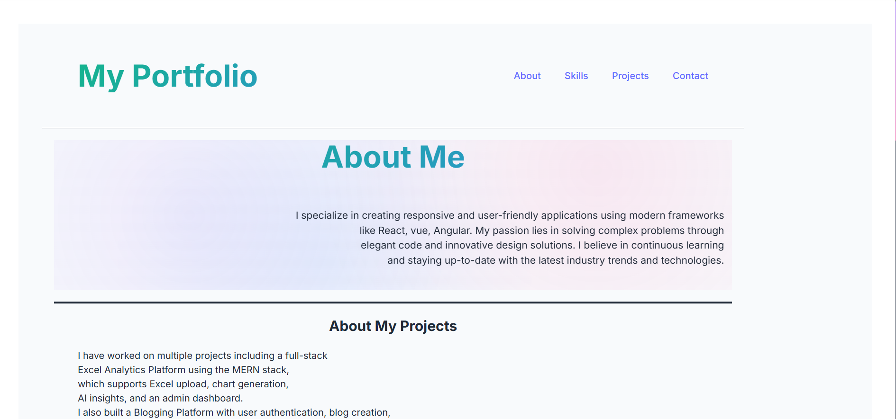
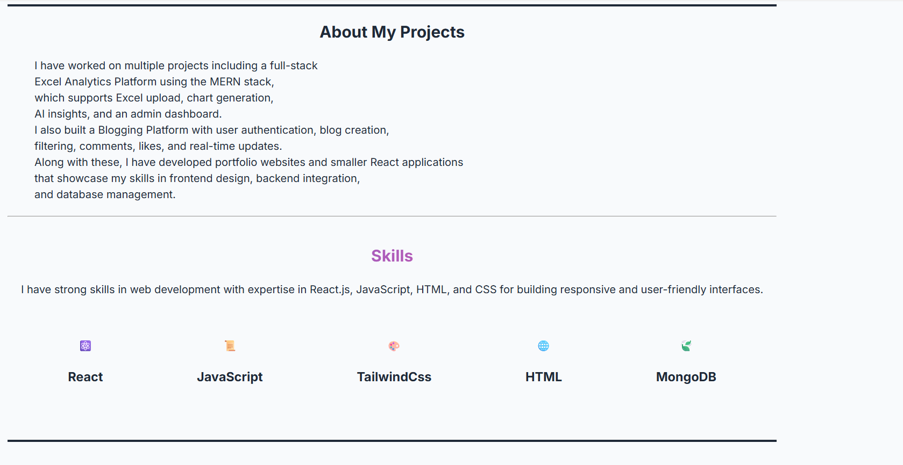
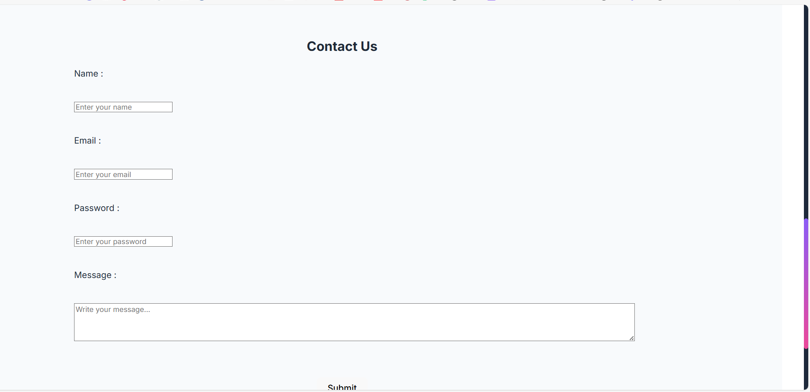

A modern, responsive portfolio website built with React, Vite, and Tailwind CSS. This project showcases a clean and professional design with smooth animations and interactive components.

## 🚀 Features

- **Responsive Design** - Fully responsive layout that works on all devices
- **Modern UI/UX** - Clean and professional design with smooth animations
- **Component-Based Architecture** - Modular React components for easy maintenance
- **Fast Performance** - Built with Vite for lightning-fast development and optimized builds
- **Tailwind CSS** - Utility-first CSS framework for rapid UI development
- **Interactive Sections** - Dynamic hero section, skills showcase, project gallery, and contact form

## 📸 Screenshots





## 🛠️ Tech Stack

- **Frontend Framework**: React 18
- **Build Tool**: Vite
- **Styling**: Tailwind CSS
- **Icons**: React Icons
- **Development**: ESLint + Prettier


## 🏗️ Project Structure

```
react-demo-website/
├── public/
│   ├── vite.svg
│   └── image.png
├── src/
│   ├── assets/
│   │   ├── react.svg
│   │   └── image.png
│   ├── components/
│   │   ├── Header.jsx
│   │   ├── HeroSection.jsx
│   │   ├── ProjectSection.jsx
│   │   ├── SkillsSection.jsx
│   │   ├── ContactForm.jsx
│   │   └── Footer.jsx
│   ├── App.jsx
│   ├── App.css
│   ├── index.css
│   └── main.jsx
├── package.json
├── vite.config.js
├── tailwind.config.js
├── postcss.config.js
├── eslint.config.js
└── README.md
```

## 🎯 Components Overview

### Header
- Fixed navigation bar with smooth scroll links
- Responsive mobile menu with hamburger icon

### HeroSection
- Eye-catching hero banner with gradient background
- Animated text and call-to-action buttons
- Professional introduction section

### ProjectSection
- Portfolio showcase with project cards
- Hover effects and project details
- Links to live demos and source code

### SkillsSection
- Technical skills display with progress bars
- Categorized skill sets (Frontend, Backend, Tools)
- Visual skill level indicators

### ContactForm
- Functional contact form with validation
- Email integration ready
- Responsive form layout

### Footer
- Social media links
- Copyright information
- Quick navigation links

## 🎨 Styling


## Challenges I faced
- setting up layout and adjusting page structure
- adding image to section and adjust them

The project uses **Tailwind CSS** for styling with a consistent design system:

- **Colors**: Black background with white text and accent colors
- **Typography**: Modern sans-serif fonts
- **Spacing**: Consistent spacing scale
- **Responsive**: Mobile-first responsive design

## 🚀 Available Scripts

- `npm run dev` - Start development server
- `npm run build` - Build for production
- `npm run preview` - Preview production build
- `npm run lint` - Run ESLint


## 🤝 Contributing

Contributions are welcome! Please feel free to submit a Pull Request. For major changes, please open an issue first to discuss what you would like to change.


## 📞 Contact

- **Email**:meghachauhan310@gmail.com
---

Made with ❤️ by Megha Chauhan
